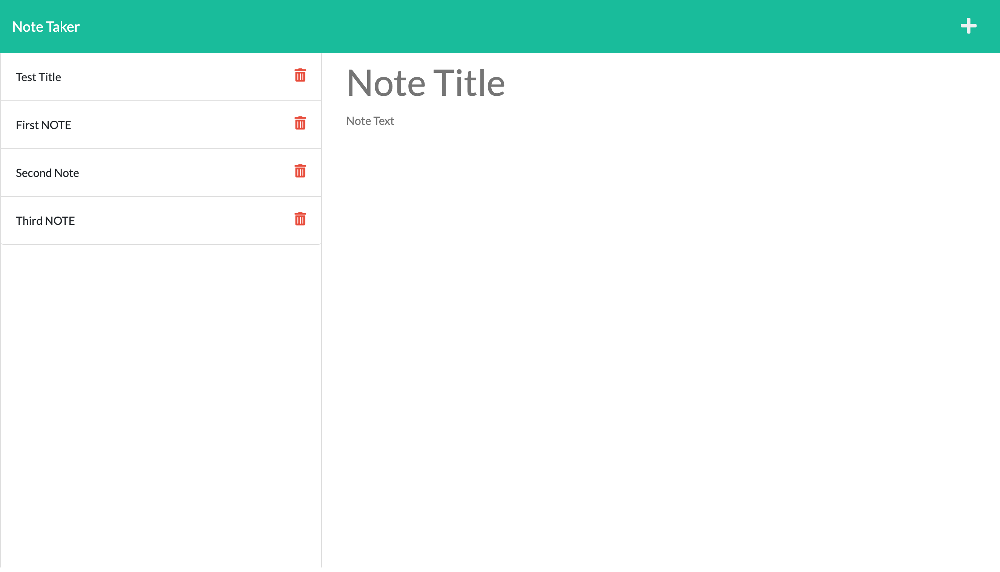

# Note Taker

## Table of Contents

1. [Description](#description)
2. [Resources](#resources)
3. [Visuals](#visuals)
4. [Author and Acknowledgements](#author-and-acknowledgements)

## Decription

The assignement requires students to use existing starter code to create an application that can be used to write and save notes. This application will use an Express.js back end. The application will save and retrieve data from a JSON file. It is my task to code the back end, connect the two, and then deploy the entire application to Heroku.

## Resources

-[LIVE SITE](https://raydover.github.io/note-taker/)

-[Repository](https://github.com/raydover/note-taker)

-[Heroku]()

## Visuals

## Author and Acknowledgements

code created by UNCC Coding Bootcamp, edited by Raymond Dover